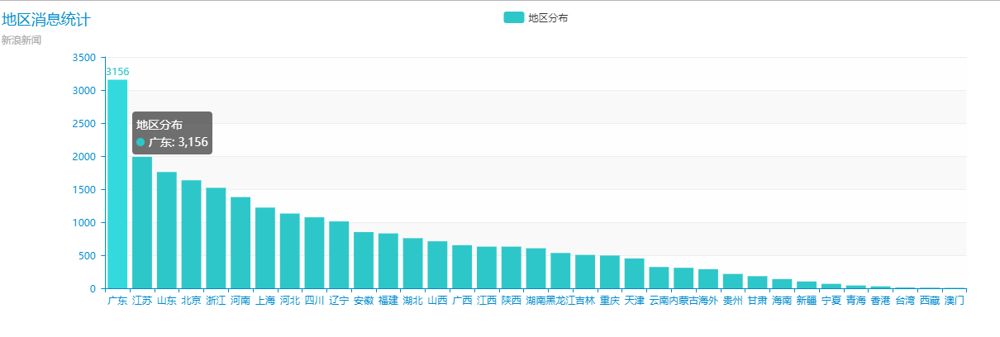
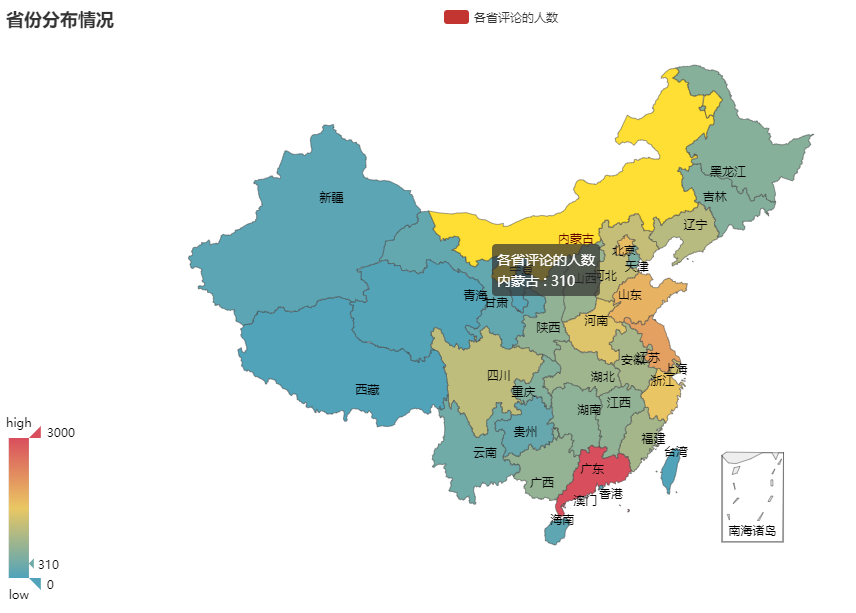
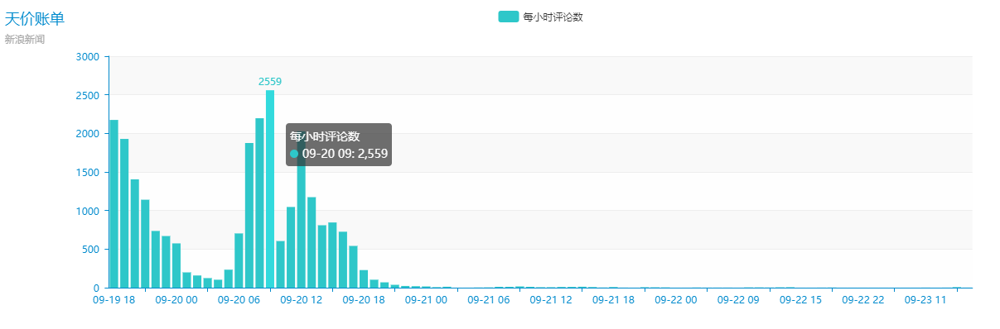
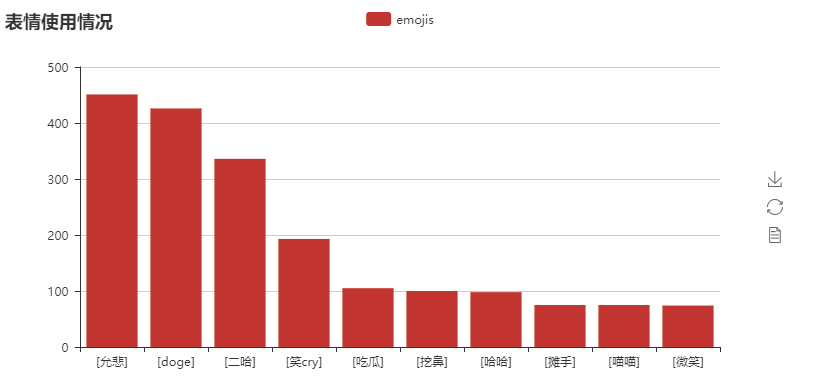

# dataScience

---

### [上海40万“天价账单”，长什么样，过来看看。](http://news.sina.com.cn/c/2018-09-19/doc-ihkhfqns9406485.shtml)

近日，上海某餐厅开出了一张 40万的账单，我秉着一个好奇的心，上网看了看，发现网友对这件事情的关注还挺高，我看了看新浪新闻下面的评论，有 20000 多条，我想看看网友们是怎么评价的。

#### 数据可视化

首先我们来看看各地区评论的人数

从直方图我们可以看出，广东的评论数最多而且超出了第二名近一半。不管是这个新闻还是其他新闻，我粗略的统计了一下，发现广东都是居首。后面了解到，广东省是中国常住人口最多的省份，人口总数达 10999 万。这样也能说明为什么广东居多了。

我们在看看更直观的中国地图

从上面的中国地图，就可以看出分布情况了，大多数评论都是在沿海地区，广东大大的红色看到了吧。

---

按地理位置分析完了，我们在看看从时间的角度来看看，让我们看看什么时候，评论的人数最多。

我是按每小时为单位统计的，从图中我们可以看的出，刚开始新闻发布的时候评论逐渐多了起来，慢慢的到达了一个巅峰，然后到半夜，逐渐的变少了。后面到了第二天的上午九点，评论又到了一个巅峰，数量达到了 2559 条，时间是 9月20号上午9点，周四。难道一大早去了公司，先看看新闻？我想如果数据量大，应该更有说服性。

---

接下来是情感分析，我们从两个方面来分析，一个使用最多的表情，一个是使用最多的词语。通过这些，我们可以从侧面得出，人们对这件事情的看法。

从表情来看，人们对这个事情反响是属于吃瓜群众的，看看热闹。

从词云来看，人们讨论的最多还是迪拜有钱人，新闻中指出，这个账单的确和迪拜人有关，这也说明，数据是正确的。虽然说这个事件也过去了几天，而且数据量不是很大，但是我觉得还是有一定的可信度的。